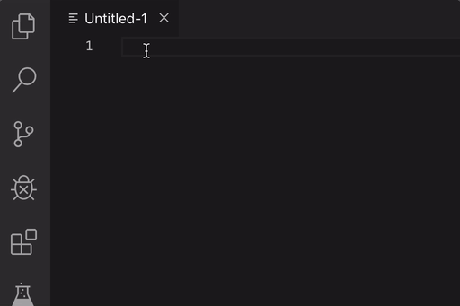

# Color Vision

Color Vision is a utility extension for VSCode that provides a way of visualizing colors in your documents.

## Features

Color Vision detects HEX, HEXA, RGB, and RGBA and displays a color swatch next to the color value so that you can see exactly how the color will look.

## Known Issues

None at the moment. If you find one, please submit an issue but please observe the [Contributor Code of Conduct](CODE-OF-CONDUCT.md).

## Release Notes

### 0.1.0

Initial release of Color Vision with support for HEX and RGBX colorspaces. Now available in the VS Code Extention Marketplace <https://marketplace.visualstudio.com/items?itemName=wilsonsio.color-vision>

**Enjoy!**

Please note that this project is released with a [Contributor Code of Conduct](CODE-OF-CONDUCT.md). By participating in this project you agree to abide by its terms.
